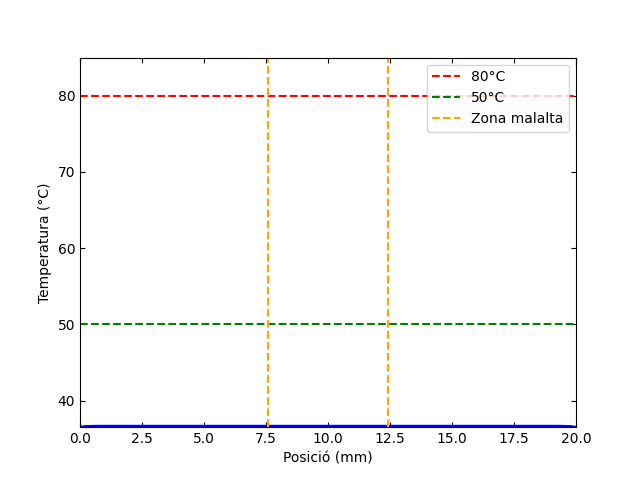

El programa `tobj` calcula el gradient de temperatura en el teixit per un temps adimensional $t^* = 0.025$

---

El programa `cranknicolson` calcula el temps durant el qual la zona malalta supera els 50 °C, mentre no es compleixin les següents condicions de seguretat:  

- La regió sana no ha d’arribar a 50 °C  
- Cap punt no ha de superar els 80 °C  

Aquest programa i l'anterior implementen el mètode de Crank–Nicolson per resoldre l’equació de calor en 1D.

El gif s'ha generat amb el codi python `grafiquesCN`

---

Els codis Fortran es poden executar directament amb els executables ja compilats. Però si es volen compilar a partir del codi, s'ha de fer amb algun compilador, com per exemple **[gfortran](https://fortran-lang.org/learn/os_setup/install_gfortran)**.
