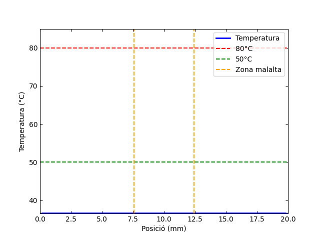

El programa `eulerexplicit` calcula el temps durant el qual la zona malalta supera els 50 °C, mentre no es compleixin les següents condicions de seguretat:  

- La regió sana no ha d’arribar a 50 °C  
- Cap punt no ha de superar els 80 °C  

Aquest programa implementa el mètode d'Euler Explícit per resoldre l’equació de calor en 1D.

El gif s'ha generat amb el codi python `grafiquesEE`

---

El codi Fortran es pot executar directament amb l'executable ja compilat. Però si es vol compilar a partir del codi, s'ha de fer amb algun compilador, com per exemple **[gfortran](https://fortran-lang.org/learn/os_setup/install_gfortran)**.
